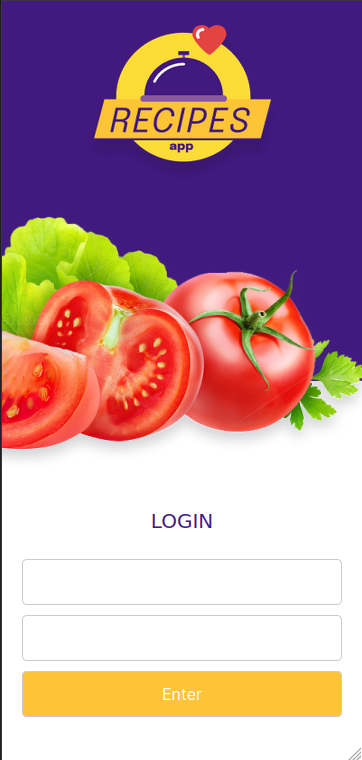

<h1 align="center">Welcome to Isa Recipe 👋</h1>
<p>
  
  
</p>

> Eis o teu App de receitas! Prepare deliciosos pratos a um clique de distância
Nele você poderá ver, buscar, filtrar, favoritar e acompanhar o progresso de preparação de receitas de comidas e bebidas!


O layout tem como foco dispositivos móveis. Assim, todos os protótipos estarão desenvolvidos em telas menores.

### 🏠 [Homepage](isarecipe.surge.sh)

## o que você verá!



Não se esqueça dos seus dados pessoais de login _(acesse o README para encontrar)_
<!-- email: user@user.com    pass: password123 -->


## Tech SKills utilizadas
 _Na base de dados serão duas APIs distintas: uma para comidas e outra para bebidas._
 _Redux para gerenciar estado._
 _Biblioteca React-Redux._
 _Context API do React para gerenciar estado._
 _React Hook useState._
 _React Hook useContext._
 _React Hook useEffect._
 _Hooks customizados._

## Prerequisites

- node 18

## Install

```sh
npm install
```

## Usage

```sh
npm run start
```

## Author

👤 **Isabel Moraes**

* Github: [@IsabelMoraes](https://github.com/IsabelMoraes)
* LinkedIn: [@isabelmoraesdev](https://linkedin.com/in/isabelmoraesdev)

**Colaboração**

Projeto desenvolvido em grupo durante a formação do curso de Desenvolvedor Fullstack Trybe

## Show your support

Give a ⭐️ if this project helped you!

***
_This README was generated with ❤️ by [readme-md-generator](https://github.com/kefranabg/readme-md-generator)_